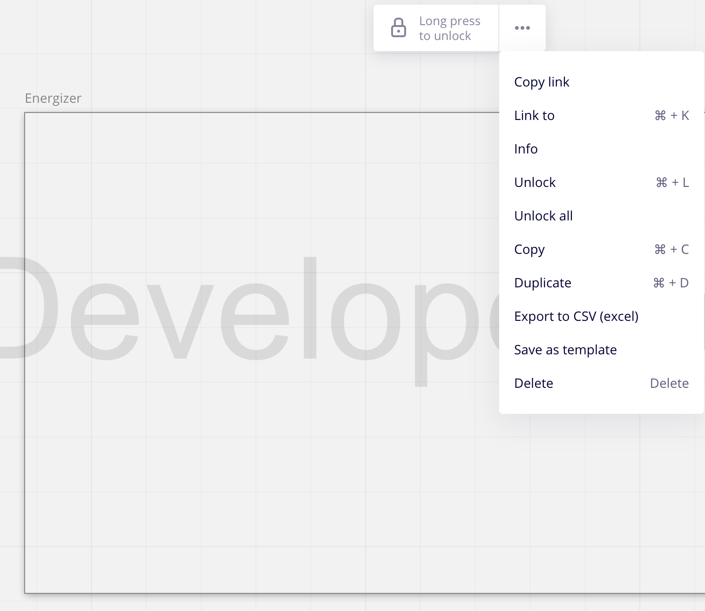

# Miro Collaboration Demo

> *These instructions are written for someone who works at Miro.*


The following instructions will prepare you to demo the Miro REST API to
a technical audience with some web development experience. Please read
through the entire README. The README will provide you with:
- an understanding of the strategic messaging we would like to convey,
- setup instructions for the demo, as well as a suggested window
  setup for the demo and instructions for how to reset the demo in
  between runs,
- a demo outline, containing the script and instructions for actions you
  need to take during the demo.

## Strategic Messaging

This demo shows off Miro's REST API to demonstrate the benefits of
platform integrations and, to a lesser extent, of Miro.

- Miro is a platform for modern work, enabling teams to communicate and
  collaborate across formats, tools, channels, and time zones.

- Easily automate your custom workflows with your Miro boards by
  building integrations with the Miro Platform API.
## Setup Instructions

1. Set up Miro board
   1. The Miro board should have a welcome "slide" that welcomes your
      specific audience.
   2. Add some content for activities like planning and retros, to the right
      of your welcome slide.
   3. Add a frame with the name "Energizer" to the left of your welcome
   4. Lock the Energizer frame by clicking on the lock icon, so you can
      delete the frame content without deleting the frame.
2. [Create a Miro dev team](https://developers.miro.com/docs/getting-started)
3. Set up app
   1. Clone the repo and install the dependencies
      ```bash
      git clone git@github.com:npentrel/miro-demo.git
      cd miro-demo
      npm install
      ```
    2. Run `cp .env.example .env`.
    3. Get the `boardId` and `inboxFrameId` from the miro board you created
       for this demo and add the variables in your `appConfig` object in the
       `index.js` file:

       ```javascript
       const appConfig = {
         boardId: '',
         inboxFrameId: '',
       }
       ```

       To get the frame and board id, click on the Energizer frame and
       then on the copy link option, as in the screenshot below:

       

       The copied link has the frame id within `moveToWidget` query param, e.g.
      `https://miro.com/app/board/<board-id>/?moveToWidget=<frame-id>&cot=14`.
4. Upgrate Miro account or, if it's a smaller demo audience, invite demo
   audience to the miro board, so they can participate.

### Windows to have open for the demo

1. Chrome
   1. Miro board
   2. [Getting Started Page](https://developers.miro.com/docs/getting-started)
   3. [API Reference Page](https://developers.miro.com/reference#create-board-widgets)
2. VSCode with code
   1. `.env` file
   2. `index.js` file
3. iTerm - to run the script

### Between runs

1. Delete the content that is in the energizer frame
2. Clear console
3. Delete the demo app on [Your apps](https://miro.com/app/settings/user-profile/apps)

## Demo Outline

> *Please adjust script based on your own Miro experience. This is an
  example script to give you an idea of what you may want to say - you do
  not need to use it as is.*

> (Titles) *- are not spoken script and only indicate the section of the
demo you are in*

> [Instructions] *- are to tell you what actions to perform while you
speak. Do not read these instructions during the demo.*


1. (Intro)
   - We've spent this pandemic working remotely and with that some online
     collaboration tools have become more popular. One of these tools is
     Miro. Miro is a collaboration platform based on the idea of a virtual
     whiteboard. Here is an example:
     > [Show miro board on the welcome slide]
   - Miro enables teams to communicate and collaborate across different
     formats, tools, channels, and time zones. My team uses it for
     standups and our weekly planning and retros. Lots of these workflows
     already have integrations with Jira, Google Docs, and GitHub.
     > [Show other parts of the example board with these activities]
3. (Problem)
   - Miro is still in its growth phase though and sometimes we want to
     do things with it for which there are no apps yet. One of the things we
     wanted to do was have energizers at the beginning of our retros -
     because we used to do this when we were all in the same office.
4. (API introduction)
   - Well, Miro has a platform API that allow us to extend Miro's
     functionality and programmatically interact with Miro, so we can
     integrate other platforms with Miro. In this case. All I want to do
     is programmatically create an Energizer.
5. (API Setup)
    - Let me show you how I created my Energizer App.
      > [Go to Getting Started page]
    - This is where you get started creating your own apps with the Miro
      platform. The first step is to create a dev team. I already have
      one so this will directly take me to my apps page.
      > [Click on `Get Dev Team to Create an App` or `Your apps`]
    - Here I can create my Miro Platform app. I'll call it `energizer`.
      > [Agree to the terms and conditions, click `Create new app` and use
        `energizer` as the  name. Then click on `Create app`.]
    - Here we go. What we need from this app page is just the OAuth token with
      the `boards:write` and `boards:read` permissions. And I will install this
      app so that it can access my normal boards so on my account's team. Of
      course I will change this token after this demo is over.
      > [Select `boards:write` and `boards:read` permissions and click on
        install app, then select your normal account so your app can access
        all your normal boards and click `Install & authorize`.]
    - Ok, let me copy this token and put it into my environment variables
      for this app.
      > [Copy the token and paste it into the `.env` file.]
7. (Solution)
    - Now, let me go back to the presentation I showed you in the
      beginning. And I've already prepared something to the left of this.
      This is just an empty frame right now. But I would like it to
      populate with content for an energizer for my team. Ideally I want a
      smaller frame for each of my team mates with the prompt for the
      energizer and a countdown.
      > [Go back to the presentation and show the Energizer frame.]
    - Let me show you the code.
      > [Switch to `index.js`]
    - Up at the top you can see I have already filled in some variables
      that identify the Miro board and the energizer frame.
      > [Highlight the `appConfig` variable.]
    - Then we've got some variables that define how long the engergizers should
      be, my team mates names, and some energizer prompts. And then
      the interesting bit. The `MiroBoardApiService`. This service
      provides a small wrapper around the Miro REST API to make it easier
      for us to create, get, and update widgets. Each function maps to an api
      endpoint. There is one function that I haven't filled in yet so I
      can show you how to do it and that is the create widget function.
      > [Highlight relevant code as you mention it.]
    - Let me show you the Miro REST API Reference for the API and then
      we can fill in the missing function.
      > [Open REST API page for create widget]
    - This is how you create widgets. You specify the board id and then specify
      the widget type and some content. To the right you can see example
      responses. If you add a board id here you can actually also perform
      API calls right from here.
    - Let me copy the URL up here and note that is says `POST`. We're going to
      need that.
    - Back to the code
      > [Switch back to the code. Paste the URL in.]
    - We're using axios, a promise-based HTTP client. And let's start with
      setting up the variable. We're expecting a response so we'll type in
      `const response` and then we'll return the `response.data` at the end
      of the function. Now in between we're going to add the post request by
      saying `await axios.post(``)` and then we add the URL that we copied
      before. and of course we need to add in the board id. Next we add the
      `widgetData` as an argument and then we just need to give this function
      the headers. That should do it.
      > [Narrate as you add the following code]
         ```javascript
         const response = await axios.post(`https://api.miro.com/v1/boards/${this._miro.boardId}/widgets`, widgetData, this._headers);
         return response.data;
         ```
    - The rest of this code is the Energizer service. There is some code
      that randomly selects an energizer. Then some code that splits
      up the dedicated energizer frame into sections for team members. And
      lastly two methods that deal with adding a countdown and updating
      it. As well as a helper method that deals with all the board setup.
      The main function at the bottom puts it all together.
    - So - only one thing left to do. Let's try it.
      > [Depending on the audience you can show the miro board URL and have
        the audience join you to play through an energizer]
    - So let me put the console on top of the miro board for a moment and
      run `npm start`.
      > [Switch back to the miro board, and put the console on top of the miro board and run `npm start`, then switch back to the miro board]
8. (Play the energizer)
    - The app has now selected a random energizer and we can see it
      populated in the energizer frame here. In this case the energizer is a prompt to draw an owl with the pen tool in 60 seconds.
      > [Mention the energizer that was selected and play with the audience
        if the audience has joined.]
    - You can see down here, the time that is left, this updates every 5
      seconds.
 9. (Conclusion)
    - That's it! This is how simple it is to build small custom workflows on
      top of the Miro API to make collaboration even easier. And I think we
      now have time for questions!
